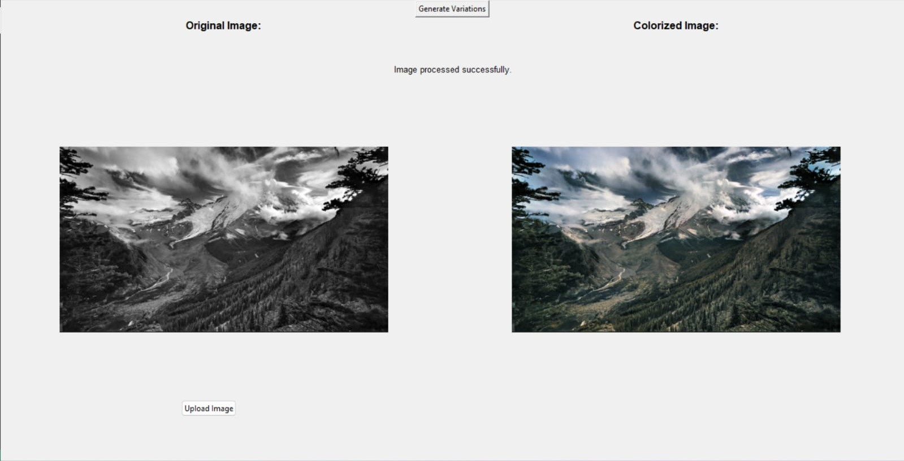
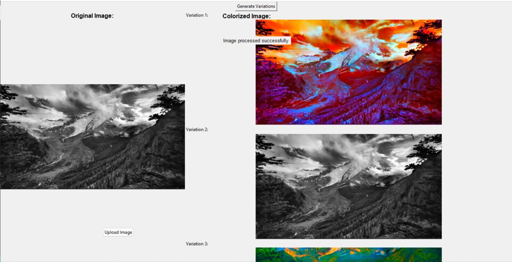

# DeOldify Image Colorization App

### Overview

This project is a Python application that utilizes the DeOldify library to colorize black and white images. It also provides the functionality to generate variations of the colorized image based on different hue shifts and saturation levels.

### Installation
Clone the repository and change path to Deoldify:
```bash
git clone https://github.com/SDeyGitHubber/DeOldify.git
cd DeOldify
```

Install the required dependencies:

```bash
pip install -r requirements.txt
```

### Usage
Run the application:

```bash
python app.py
```
Once the application is running, you can upload black and white images and view their colorized versions. Additionally, you can generate multiple variations of the colorized image.

### Tools and Technologies Used
- Python
- tkinter
- PIL (Pillow)
- deoldify
- matplotlib
- fastai
- opencv-python
- Google colab
- Jupyter Notebook

### Gallery

#### The input black and white image is colorised


#### A user can generate n number of variations of the colorized image


### About DeOldify Library
DeOldify is an open-source deep learning project that utilizes Generative Adversarial Networks (GANs) to automatically colorize black and white images. It provides high-quality colorization results and is widely used in various image colorization applications.